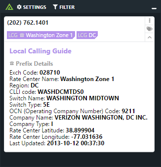

# Polarity Local Calling Guide Integration

The Polarity Local Calling Guide integration leverages the xmlquery interface of Local Calling Guide (https://localcallingguide.com/) to perform a NPA/NXX (area code/prefix) search on telephone numbers.

The integration will recognize phone numbers with the following formats:

* (888) 123 4567
* 888-123-4567
* 888.123.4567
* (888) 123.4567
* (888) 123-4567

|  |
|---|
|*Phone number lookup example* |

## Installation Instructions

Installation instructions for integrations are provided on the [PolarityIO GitHub Page](https://polarityio.github.io/).

## Polarity

Polarity is a memory-augmentation platform that improves and accelerates analyst decision making.  For more information about the Polarity platform please see:

https://polarity.io/
